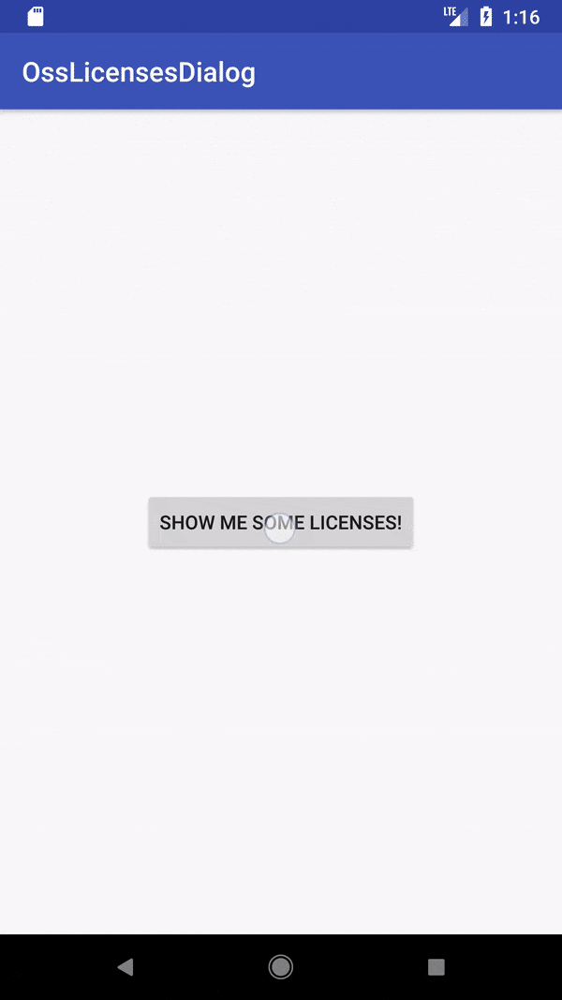

# LicensesDialog

LicensesDialog is a simple, clean way to credit the open source software your app uses.



## Example

Create a list of `Notices`:

```kotlin
val notices = listOf(
    Notice("Library #1", ApacheLicense20, "www.url.com", Copyright("Author", 2018)),
    Notice("Library #2", MitLicense, Copyright("Author", 2017))
)
```

Then show the `LicensesDialog`:

```kotlin
LicensesDialog.Builder(context)
    .setNotices(notices)
    .show()
```

You can also check out the sample [here](sample/src/main/java/com/colinrtwhite/licensesdialog/sample/MainActivity.kt).

## Download

Add [JitPack](https://jitpack.io) to your list of repositories:

```groovy
repositories {
    maven { url 'https://jitpack.io' }
}
```

And add the library to your list of dependencies:

```groovy
dependencies {
    implementation 'com.github.colinrtwhite:licensesdialog:1.0.0'
}
```

## PSDev/LicensesDialog

This library is inspired by [Licenses Dialog](https://github.com/PSDev/LicensesDialog), however this library has the following improvements:

- Uses a `RecyclerView` instead of a `WebView` for improved scrolling + rendering performance.
- Unused license resources are stripped by Proguard.
- Opens links in [Chrome Custom Tabs](https://developer.chrome.com/multidevice/android/customtabs).
- Support for dark themed dialogs.
- Expandable license text.

## License

```
Copyright 2018 Colin White

Licensed under the Apache License, Version 2.0 (the "License");
you may not use this file except in compliance with the License.
You may obtain a copy of the License at

   http://www.apache.org/licenses/LICENSE-2.0

Unless required by applicable law or agreed to in writing, software
distributed under the License is distributed on an "AS IS" BASIS,
WITHOUT WARRANTIES OR CONDITIONS OF ANY KIND, either express or implied.
See the License for the specific language governing permissions and
limitations under the License.
```
